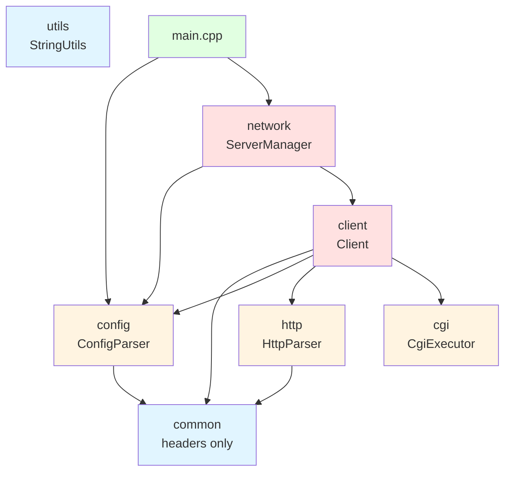

# Implementación de CMake Modular para Webserv

## Descripción

El objetivo es modularizar el sistema de construcción CMake del proyecto webserv, donde cada subdirectorio en `src/` se convierte en una biblioteca estática privada con su propio `CMakeLists.txt`. El `CMakeLists.txt` principal orquestará todas estas bibliotecas y las enlazará al ejecutable final.

### Estructura Actual

El proyecto tiene 7 módulos en `src/`:
- **common**: Tipos comunes, utilidades y namespaces (solo headers)
- **utils**: Utilidades de strings y helpers
- **config**: Parser de configuración y clases relacionadas (ya tiene CMakeLists.txt)
- **http**: Parser HTTP, request/response
- **cgi**: Ejecución de procesos CGI
- **client**: Manejo de clientes y procesamiento de requests
- **network**: Gestión de servidor, epoll, listeners

### Grafo de Dependencias



## Cambios Propuestos

### Módulo Common

#### [NEW] [CMakeLists.txt](file:///home/daruuu/CLionProjects/webserv-fork/src/common/CMakeLists.txt)

Biblioteca de solo headers (INTERFACE library) que contiene:
- `Types.hpp`
- `Utils.hpp`
- `namespaces.hpp`

---

### Módulo Utils

#### [NEW] [CMakeLists.txt](file:///home/daruuu/CLionProjects/webserv-fork/src/utils/CMakeLists.txt)

Biblioteca estática con:
- `StringUtils.cpp`
- `StringUtils.hpp`

---

### Módulo Config

#### [MODIFY] [CMakeLists.txt](file:///home/daruuu/CLionProjects/webserv-fork/src/config/CMakeLists.txt)

Actualizar para:
- Agregar dependencia de `common` (INTERFACE)
- Incluir `mainConfig.cpp` en la biblioteca
- Mantener la estructura existente

---

### Módulo HTTP

#### [NEW] [CMakeLists.txt](file:///home/daruuu/CLionProjects/webserv-fork/src/http/CMakeLists.txt)

Biblioteca estática con:
- `HttpParser.cpp`, `HttpParserBody.cpp`, `HttpParserHeaders.cpp`, `HttpParserStartLine.cpp`
- `HttpRequest.cpp`, `HttpResponse.cpp`
- `HttpHeaderUtils.cpp`
- Headers correspondientes

Dependencias:
- `common` (para namespaces y tipos)

---

### Módulo CGI

#### [NEW] [CMakeLists.txt](file:///home/daruuu/CLionProjects/webserv-fork/src/cgi/CMakeLists.txt)

Biblioteca estática con:
- `CgiExecutor.cpp`
- `CgiProcess.cpp`
- Headers correspondientes

Dependencias:
- `common`

---

### Módulo Client

#### [NEW] [CMakeLists.txt](file:///home/daruuu/CLionProjects/webserv-fork/src/client/CMakeLists.txt)

Biblioteca estática con todos los archivos `.cpp`:
- `Client.cpp`, `ClientCgi.cpp`
- `RequestProcessor.cpp`, `RequestProcessorUtils.cpp`
- `ResponseUtils.cpp`, `ErrorUtils.cpp`
- `AutoindexRenderer.cpp`, `StaticPathHandler.cpp`
- Headers correspondientes

Dependencias:
- `common`
- `config`
- `http`
- `cgi`

---

### Módulo Network

#### [NEW] [CMakeLists.txt](file:///home/daruuu/CLionProjects/webserv-fork/src/network/CMakeLists.txt)

Biblioteca estática con:
- `ServerManager.cpp`
- `EpollWrapper.cpp`
- `TcpListener.cpp`
- Headers correspondientes

Dependencias:
- `common`
- `config`
- `client`

---

### CMakeLists.txt Principal

#### [MODIFY] [CMakeLists.txt](file:///home/daruuu/CLionProjects/webserv-fork/CMakeLists.txt)

Cambios:
1. Agregar `add_subdirectory()` para todos los módulos en orden de dependencias
2. Actualizar el ejecutable `webserv` para usar solo `src/main.cpp`
3. Enlazar todas las bibliotecas en el orden correcto
4. Limpiar comentarios obsoletos

Orden de inclusión de subdirectorios:
```cmake
add_subdirectory(src/common)   # Sin dependencias
add_subdirectory(src/utils)    # Sin dependencias
add_subdirectory(src/config)   # Depende de common
add_subdirectory(src/http)     # Depende de common
add_subdirectory(src/cgi)      # Depende de common
add_subdirectory(src/client)   # Depende de common, config, http, cgi
add_subdirectory(src/network)  # Depende de common, config, client
```

Enlace de bibliotecas al ejecutable:
```cmake
target_link_libraries(webserv PRIVATE
    network    # Nivel más alto
    client     # Dependencia de network
    cgi        # Dependencia de client
    http       # Dependencia de client
    config     # Dependencia de client y network
    utils      # Utilidades generales
    common     # Headers comunes (INTERFACE)
)
```

## Plan de Verificación

### Pruebas Automatizadas

1. **Compilación limpia**
   ```bash
   cd /home/daruuu/CLionProjects/webserv-fork
   rm -rf build
   mkdir build && cd build
   cmake ..
   make
   ```
   - Verificar que no hay errores de compilación
   - Verificar que todas las bibliotecas se crean correctamente
   - Verificar que el ejecutable `webserv` se genera

2. **Verificar bibliotecas generadas**
   ```bash
   cd /home/daruuu/CLionProjects/webserv-fork/build
   find . -name "*.a" | sort
   ```
   - Debe mostrar: `libcgi.a`, `libclient.a`, `libconfig.a`, `libhttp.a`, `libnetwork.a`, `libutils.a`
   - `common` no debe generar `.a` (es INTERFACE)

3. **Ejecutar tests existentes**
   ```bash
   cd /home/daruuu/CLionProjects/webserv-fork/build
   ctest --verbose
   ```
   - Verificar que los tests unitarios pasan
   - Verificar que los tests de integración funcionan

4. **Ejecutar el servidor**
   ```bash
   cd /home/daruuu/CLionProjects/webserv-fork
   ./build/webserv config/default.conf
   ```
   - Verificar que el servidor inicia sin errores
   - En otra terminal: `curl http://localhost:8080`
   - Verificar que responde correctamente

### Verificación Manual

1. **Inspeccionar dependencias de enlace**
   ```bash
   cd /home/daruuu/CLionProjects/webserv-fork/build
   ldd webserv
   ```
   - Verificar que no hay dependencias faltantes

2. **Verificar estructura de directorios**
   ```bash
   cd /home/daruuu/CLionProjects/webserv-fork
   find src -name "CMakeLists.txt" | sort
   ```
   - Debe mostrar un `CMakeLists.txt` en cada subdirectorio de `src/`

3. **Revisar logs de compilación**
   - Verificar que cada biblioteca se compila con las flags correctas (`-Wall -Wextra -Werror`)
   - Verificar que se usa `-std=c++98`
