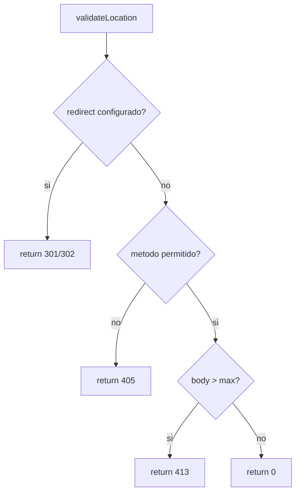

# Diagrama de flujo: RequestProcessor + StaticPathHandler

```mermaid
flowchart TD
    A[RequestProcessor::process] --> B{parseError o metodo UNKNOWN?}
    B -- si --> B1[400 Bad Request] --> Z[fillBaseResponse + return]
    B -- no --> C[selectServerByPort]
    C --> D{server encontrado?}
    D -- no --> D1[500/404] --> Z
    D -- si --> E[matchLocation]
    E --> F{location encontrada?}
    F -- no --> F1[404 Not Found] --> Z
    F -- si --> G[validateLocation]
    G --> H{codigo != 0?}
    H -- si --> H1[buildErrorResponse(code)] --> Z
    H -- no --> I[resolvePath]
    I --> J{isCgiRequest?}
    J -- si --> J1[TODO CGI handler (501)] --> Z
    J -- no --> K[handleStaticPath]
    K --> K1{error?}
    K1 -- si --> Z
    K1 -- no --> Z
```

## Detalle: validateLocation



## Detalle: handleStaticPath (StaticPathHandler)

```mermaid
flowchart TD
    H[handleStaticPath] --> S{stat(path) ok?}
    S -- no --> S1[404] --> R[return true]
    S -- si --> D{es directorio?}
    D -- si --> I[buscar index.html]
    I --> I1{index existe?}
    I1 -- si --> L[leer archivo] --> R0[return false]
    I1 -- no --> A{autoindex ON?}
    A -- si --> A1[TODO listar directorio] --> R0
    A -- no --> F[403] --> R
    D -- no --> F2{es archivo regular?}
    F2 -- no --> F3[403] --> R
    F2 -- si --> M{metodo}
    M -- POST --> M1[405] --> R
    M -- DELETE --> M2[unlink]
    M2 --> M3{ok?}
    M3 -- no --> M4[500] --> R
    M3 -- si --> M5[body vacio] --> R0
    M -- GET --> L2[leer archivo]
    L2 --> L3{ok?}
    L3 -- no --> F4[403] --> R
    L3 -- si --> R0[return false]
```
