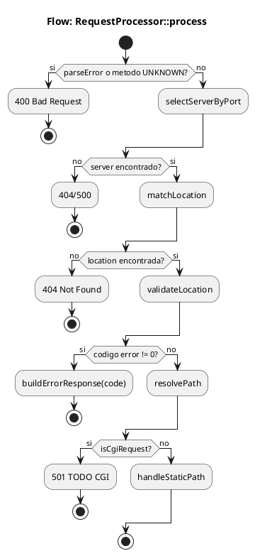

# Diagrama de flujo: RequestProcessor::process

```plantuml
@startuml
title Flow: RequestProcessor::process

start
if (parseError o metodo UNKNOWN?) then (si)
  :400 Bad Request;
  stop
else (no)
  :selectServerByPort;
endif

if (server encontrado?) then (no)
  :404/500;
  stop
else (si)
  :matchLocation;
endif

if (location encontrada?) then (no)
  :404 Not Found;
  stop
else (si)
  :validateLocation;
endif

if (codigo error != 0?) then (si)
  :buildErrorResponse(code);
  stop
else (no)
  :resolvePath;
endif

if (isCgiRequest?) then (si)
  :501 TODO CGI;
  stop
else (no)
  :handleStaticPath;
endif

stop
@enduml
```
