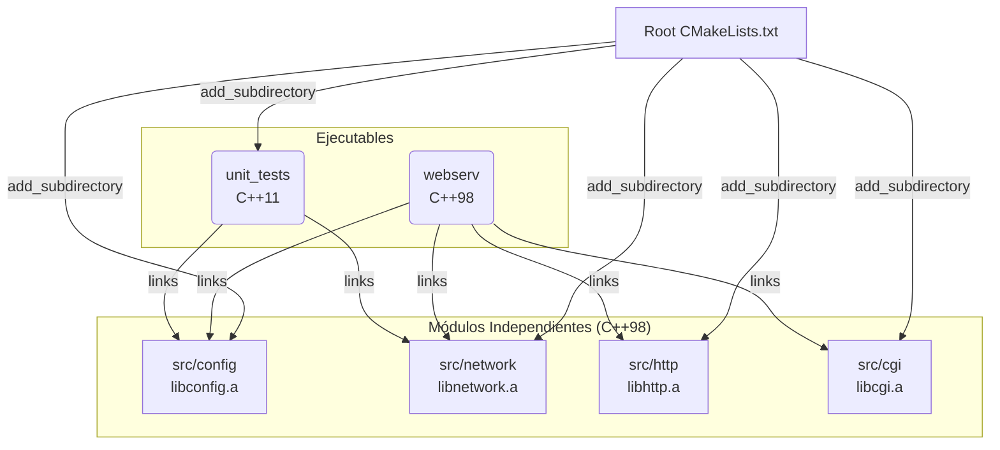

# Arquitectura Modular con CMake para Webserv

Esta guía explica cómo estructurar tu proyecto `webserv` para que sea escalable, modular y permita configuraciones híbridas (C++98 para el proyecto, C++11 para tests).

## 1. El Concepto: "Todo es una Librería"

La estrategia clave para escalar es tratar cada carpeta dentro de `src/` (`config`, `network`, `http`) como un módulo independiente que genera una **Librería Estática (`.a`)**.

El [CMakeLists.txt](file:///home/daruuu/CLionProjects/webserv-fork/CMakeLists.txt) principal actúa como un "Orquestador" que une estas piezas.

### Diagrama de Flujo (Mermaid)



## 2. Configuración Detallada por Niveles

### Nivel 1: El Orquestador (Raíz)
Configura las reglas globales y une todo.

**Archivo:** [CMakeLists.txt](file:///home/daruuu/CLionProjects/webserv-fork/CMakeLists.txt)
```cmake
cmake_minimum_required(VERSION 3.10)
project(webserv VERSION 0.1.0 LANGUAGES CXX)

# --- Configuración Global ---
set(CMAKE_CXX_STANDARD 98)          # Por defecto C++98 para todo
set(CMAKE_CXX_STANDARD_REQUIRED ON)
set(CMAKE_CXX_EXTENSIONS OFF)       # Asegura estricto C++98 (no gnu++98)

# --- Añadir Módulos (Librerías) ---
# El orden importa si hay dependencias entre ellos (ej: http depende de config)
add_subdirectory(src/config) 
# add_subdirectory(src/network) # Descomentar cuando existan
# add_subdirectory(src/http)

# --- Ejecutable Principal ---
# Cuando integres todo, cambiarás mainConfig.cpp por main.cpp
add_executable(webserv src/config/mainConfig.cpp) 

# Enlazar las librerías al ejecutable
target_link_libraries(webserv PRIVATE 
    config
    # network
    # http
)

# --- Testing (Opcional) ---
option(BUILD_TESTING "Build unit tests" ON)
if(BUILD_TESTING)
    enable_testing()
    add_subdirectory(tests/unit)
endif()
```

### Nivel 2: Los Módulos (Ej: Config)
Cada carpeta se preocupa solo de sí misma.

**Archivo:** [src/config/CMakeLists.txt](file:///home/daruuu/CLionProjects/webserv-fork/src/config/CMakeLists.txt)
```cmake
# Define una librería estática llamada 'config'
add_library(config STATIC
    ConfigParser.cpp
    ServerConfig.cpp
    LocationConfig.cpp
    ConfigException.cpp
    # Headers no son obligatorios en add_library pero ayudan en IDEs
)

# Define dónde están los headers (.hpp) para que otros puedan incluirlos
target_include_directories(config PUBLIC ${CMAKE_CURRENT_SOURCE_DIR})
```

### Nivel 3: Testing (Híbrido C++11)
Aquí es donde hacemos la "magia" para cambiar de versión solo para los tests.

**Archivo:** [tests/unit/CMakeLists.txt](file:///home/daruuu/CLionProjects/webserv-fork/tests/unit/CMakeLists.txt)
```cmake
# Obtenemos todos los archivos .cpp de test
file(GLOB TEST_SOURCES "*.cpp")

add_executable(unit_tests ${TEST_SOURCES})

# --- MAGIA AQUÍ: Sobreescribimos el estándar solo para este target ---
set_target_properties(unit_tests PROPERTIES CXX_STANDARD 11)

# Enlazamos con las librerías del proyecto (que están en C++98)
target_link_libraries(unit_tests PRIVATE 
    config
    # network
)

# Includes necesarios (para encontrar catch2 y los headers del proyecto)
target_include_directories(unit_tests PRIVATE
    ${CMAKE_SOURCE_DIR}/src/config
    ${CMAKE_SOURCE_DIR}/lib/catch2
)
```

## 3. Flujo de Trabajo para ti (Parsing)

1.  **Desarrollo:** Sigues trabajando en `src/config/`.
2.  **Compilación local:** Como el `CMakeLists.txt` raíz apunta a `src/config/mainConfig.cpp` como source del ejecutable `webserv`, al compilar `webserv` estás ejecutando TU main de prueba de config.
3.  **Integración:**
    *   Cuando tus compañeros terminen `network` o `http`, crearán sus propios `CMakeLists.txt` definiendo librerías.
    *   Tú solo descomentarás los `add_subdirectory` en el raíz.
    *   El día final, cambiarán `add_executable(webserv src/config/mainConfig.cpp)` por `add_executable(webserv src/main.cpp)`.

## Ventajas de este Diseño
1.  **Aislamiento:** Si `src/network` no compila, tú puedes seguir trabajando en `src/config` y sus tests sin problemas (simplemente comentando la línea de network en el raíz).
2.  **Compilación Rápida:** CMake sabe qué librerías no han cambiado y no las recompila.
3.  **Flexibilidad de Testing:** Puedes usar features modernas de C++11 en los tests (como `auto`, lambdas, mejores strings) sin romper la regla de C++98 del `subject`.
