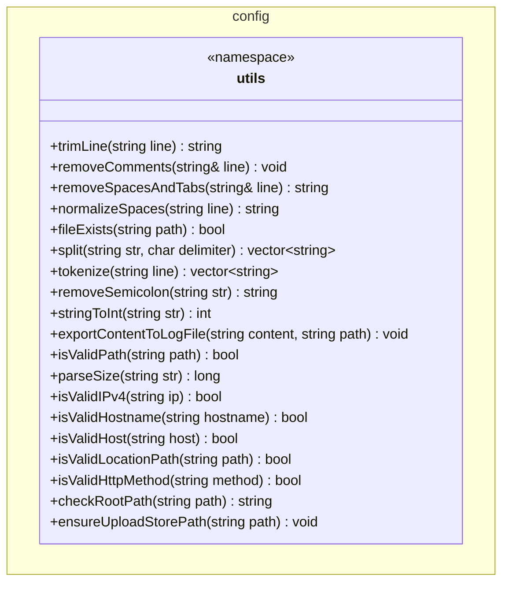

# UML: config::utils Namespace

Este diagrama representa las funciones de utilidad dentro del espacio de nombres `config::utils` definidas en [ConfigUtils.hpp](file:///home/daruuu/CLionProjects/webs-daru/src/config/ConfigUtils.hpp).

## Cómo visualizarlo
Para ver este diagrama, puedes utilizar:
1. **GitHub/GitLab**: Renderizan Mermaid automáticamente en archivos `.md`.
2. **VS Code**: Con extensiones como "Markdown Preview Mermaid Support".
3. **Editor Online**: Copia el bloque de código en [Mermaid Live Editor](https://mermaid.live/).
